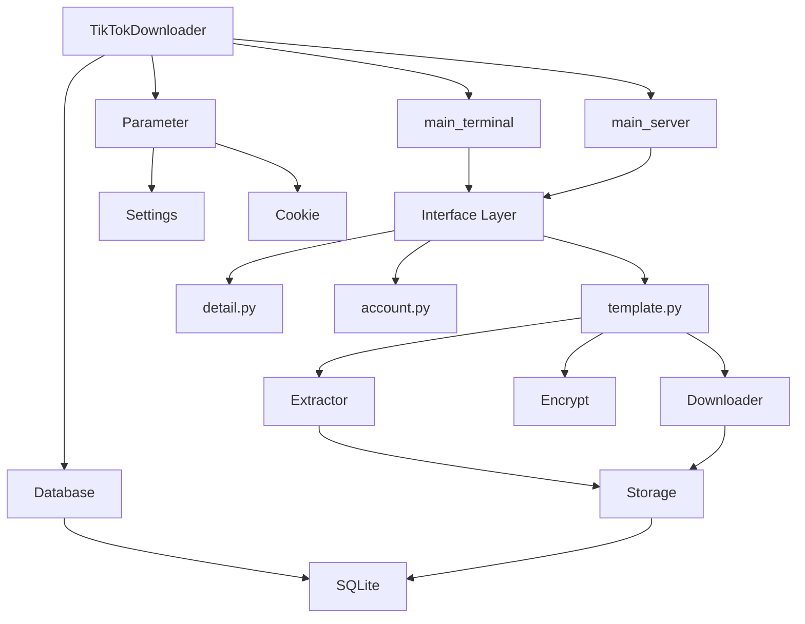
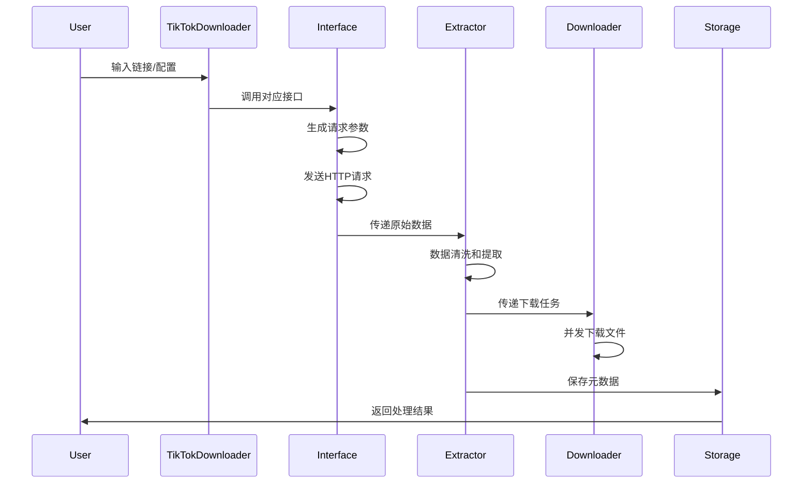

# 🔍 TikTokDownloader 项目代码深度分析

> **作者角色**: 资深Python架构师和爬虫技术专家  
> **分析时间**: 2024年  
> **项目版本**: 5.7  

---

## 📋 目录

1. [项目概览](#1-项目概览)
2. [整体架构分析](#2-整体架构分析)
3. [核心模块详解](#3-核心模块详解)
4. [数据流程分析](#4-数据流程分析)
5. [关键技术实现](#5-关键技术实现)
6. [设计模式应用](#6-设计模式应用)
7. [扩展性分析](#7-扩展性分析)
8. [最佳实践总结](#8-最佳实践总结)

---

## 1. 项目概览

### 1.1 项目定位
TikTokDownloader（现名DouK-Downloader）是一个**企业级多平台数据采集与下载系统**，专注于抖音和TikTok平台的内容获取。

### 1.2 核心特性
- 🎯 **多平台支持**: 同时支持抖音和TikTok两大平台
- 🚀 **异步架构**: 基于asyncio的高性能异步处理
- 🔧 **模块化设计**: 高度解耦的模块化架构
- 🌐 **多种交互模式**: 终端交互、Web API、Web UI
- 📊 **数据持久化**: 支持多种存储格式（SQLite、CSV、XLSX）
- 🔐 **反爬虫对抗**: 完整的加密参数生成和请求伪装

### 1.3 技术栈
```python
# 核心依赖分析
dependencies = {
    "异步网络": "httpx[socks]>=0.28.1",
    "异步文件IO": "aiofiles>=24.1.0", 
    "数据库": "aiosqlite>=0.21.0",
    "Web框架": "fastapi>=0.115.9",
    "数据验证": "pydantic>=2.10.6",
    "终端UI": "rich>=13.9.4",
    "加密算法": "gmssl>=3.2.2",
    "文档处理": "openpyxl>=3.1.5",
    "浏览器Cookie": "rookiepy>=0.5.6"
}
```

---

## 2. 整体架构分析

### 2.1 分层架构设计

```
┌─────────────────────────────────────────────────────────────┐
│                    应用层 (Application Layer)                │
├─────────────────────────────────────────────────────────────┤
│  TikTokDownloader  │  main_terminal  │  main_server  │ CLI  │
├─────────────────────────────────────────────────────────────┤
│                    接口层 (Interface Layer)                 │
├─────────────────────────────────────────────────────────────┤
│  template.py  │  detail.py  │  account.py  │  search.py    │
├─────────────────────────────────────────────────────────────┤
│                    业务层 (Business Layer)                  │
├─────────────────────────────────────────────────────────────┤
│  extractor  │  downloader  │  encrypt  │  link  │  models  │
├─────────────────────────────────────────────────────────────┤
│                    基础层 (Infrastructure Layer)            │
├─────────────────────────────────────────────────────────────┤
│  storage  │  manager  │  tools  │  config  │  translation  │
└─────────────────────────────────────────────────────────────┘
```

### 2.2 核心组件关系图



### 2.3 模块职责划分

| 模块 | 职责 | 关键类/文件 |
|------|------|-------------|
| **应用层** | 程序入口、模式切换、用户交互 | `TikTokDownloader.py`, `main_terminal.py`, `main_server.py` |
| **接口层** | API封装、请求处理、响应解析 | `template.py`, `detail.py`, `account.py` |
| **业务层** | 数据提取、文件下载、加密处理 | `extractor.py`, `download.py`, `xBogus.py` |
| **基础层** | 配置管理、存储适配、工具函数 | `parameter.py`, `manager.py`, `tools/` |

---

## 3. 核心模块详解

### 3.1 应用层 (Application Layer)

#### 3.1.1 TikTokDownloader - 主控制器

```python
class TikTokDownloader:
    """
    系统主控制器，采用上下文管理器模式
    职责：
    1. 系统初始化和资源管理
    2. 配置加载和语言切换
    3. 模式选择和功能调度
    4. 生命周期管理
    """
    
    def __init__(self):
        # 核心组件初始化
        self.console = ColorfulConsole()      # 终端输出
        self.settings = Settings()            # 配置管理
        self.database = Database()            # 数据库连接
        self.cookie = Cookie()                # Cookie管理
        self.parameter = None                 # 参数对象
        
    async def __aenter__(self):
        """异步上下文管理器入口"""
        await self.database.__aenter__()
        await self.read_config()
        return self
        
    async def __aexit__(self, exc_type, exc_val, exc_tb):
        """资源清理和连接关闭"""
        await self.database.__aexit__(exc_type, exc_val, exc_tb)
        if self.parameter:
            await self.parameter.close_client()
```

**设计亮点**:
- ✅ **异步上下文管理器**: 确保资源正确释放
- ✅ **依赖注入**: 通过构造函数注入核心依赖
- ✅ **配置驱动**: 基于数据库配置动态调整行为

#### 3.1.2 main_terminal - 终端交互模式

```python
class TikTok:
    """
    终端交互模式的核心实现
    特点：
    1. 菜单驱动的用户界面
    2. 异步批处理能力
    3. 进度显示和错误处理
    """
    
    async def _batch_process_detail(self, data: list[dict], **kwargs):
        """批量处理作品数据的核心方法"""
        # 1. 数据预处理
        id_, name, mark = self.extractor.preprocessing_data(data, **kwargs)
        
        # 2. 时间过滤
        data = self.extractor.filter_data_by_time(data, earliest, latest)
        
        # 3. 条件筛选
        data = self.extractor.condition_filter(data)
        
        # 4. 批量下载
        await self.downloader.run(data, "batch", **kwargs)
```

#### 3.1.3 main_server - Web API模式

```python
class APIServer:
    """
    基于FastAPI的Web服务器
    特点：
    1. RESTful API设计
    2. 自动文档生成
    3. 请求验证和错误处理
    """
    
    @self.server.post("/douyin/detail")
    async def handle_detail(extract: Detail):
        """处理单个作品详情请求"""
        # 参数验证 -> 数据获取 -> 结果返回
        return self.success_response(extract, data)
```

### 3.2 接口层 (Interface Layer)

#### 3.2.1 template.py - 接口模板基类

```python
class API:
    """
    所有API接口的基类，实现了通用的请求处理逻辑
    核心特性：
    1. 统一的请求参数生成
    2. 自动重试机制
    3. 进度显示
    4. 错误处理
    """
    
    async def run(self, referer=None, single_page=False, **kwargs):
        """通用的API调用方法"""
        match single_page:
            case True:
                await self.run_single(**kwargs)    # 单页请求
            case False:
                await self.run_batch(**kwargs)     # 批量请求
                
    async def run_batch(self, **kwargs):
        """批量请求处理，支持分页和进度显示"""
        with self.progress_object() as progress:
            task_id = progress.add_task("正在获取数据", total=None)
            while not self.finished and self.pages > 0:
                await self.run_single(**kwargs)
                progress.update(task_id)
```

**设计模式应用**:
- 🎯 **模板方法模式**: `run()` 定义算法骨架，子类实现具体步骤
- 🎯 **策略模式**: 通过 `single_page` 参数选择不同的处理策略

#### 3.2.2 具体接口实现

```python
# detail.py - 作品详情接口
class Detail(API):
    def generate_params(self) -> dict:
        """生成作品详情请求参数"""
        return {
            "aweme_id": self.detail_id,
            **self.params  # 继承基类通用参数
        }

# account.py - 账号作品接口  
class Account(API):
    def generate_params(self) -> dict:
        """生成账号作品列表参数"""
        return {
            "sec_user_id": self.sec_user_id,
            "max_cursor": self.cursor,
            "count": 20,
            **self.params
        }
```

### 3.3 业务层 (Business Layer)

#### 3.3.1 extractor.py - 数据提取器

```python
class Extractor:
    """
    数据提取和处理的核心组件
    职责：
    1. 原始数据清洗和标准化
    2. 字段映射和类型转换
    3. 时间过滤和条件筛选
    4. 数据验证和完整性检查
    """
    
    async def run(self, data: list[dict], recorder, type_="detail", **kwargs):
        """数据提取的统一入口"""
        if type_ not in self.type.keys():
            raise DownloaderError
        return await self.type[type_](data, recorder, **kwargs)
    
    def safe_extract(self, data: SimpleNamespace, attribute_chain: str, default=""):
        """安全的属性提取，支持链式访问"""
        attributes = attribute_chain.split(".")
        for attribute in attributes:
            if "[" in attribute:  # 支持数组索引
                # 处理 "items[0].url" 这样的路径
                parts = attribute.split("[", 1)
                attribute = parts[0]
                index = int(parts[1].split("]", 1)[0])
                data = getattr(data, attribute, None)[index]
            else:
                data = getattr(data, attribute, None)
                if not data:
                    return default
        return data or default
```

**技术亮点**:
- ✅ **链式属性访问**: 支持 `"author.avatar.url"` 这样的深层访问
- ✅ **数组索引支持**: 支持 `"images[0].url"` 这样的数组访问
- ✅ **类型安全**: 使用 `SimpleNamespace` 提供点语法访问

#### 3.3.2 download.py - 文件下载器

```python
class Downloader:
    """
    高性能异步文件下载器
    特性：
    1. 并发控制（信号量）
    2. 断点续传
    3. 进度显示
    4. 文件完整性验证
    """
    
    semaphore = Semaphore(MAX_WORKERS)  # 并发控制
    
    async def download_file(self, url: str, path: Path, **kwargs):
        """单文件下载的核心实现"""
        async with self.semaphore:  # 控制并发数
            async with self.client.stream("GET", url, **kwargs) as response:
                async with open(path, "wb") as file:
                    async for chunk in response.aiter_bytes(self.chunk):
                        await file.write(chunk)
                        
    async def batch_processing(self, data: list[dict], root: Path, **kwargs):
        """批量下载处理"""
        tasks = []
        for item in data:
            tasks.append(self.process_single_item(item, root, **kwargs))
        await gather(*tasks)  # 并发执行所有下载任务
```

#### 3.3.3 encrypt/ - 加密模块

```python
class XBogus:
    """
    X-Bogus参数生成器 - 反爬虫核心
    实现原理：
    1. URL路径MD5计算
    2. User-Agent处理
    3. 时间戳和Canvas指纹
    4. 复杂的字符串变换算法
    """
    
    def get_x_bogus(self, query: dict, params=8, user_agent=USERAGENT):
        """生成X-Bogus参数的主方法"""
        timestamp = int(time())
        
        # 1. 处理查询参数
        query_processed = self.process_url_path(urlencode(query))
        
        # 2. 生成UA数组
        ua_array = self.generate_ua_array(user_agent, params)
        
        # 3. 构建参数数组
        array = [64, 0.00390625, 1, params, query_processed[-2], 
                query_processed[-1], 69, 63, ua_array[-2], ua_array[-1],
                timestamp >> 24 & 255, timestamp >> 16 & 255,
                timestamp >> 8 & 255, timestamp >> 0 & 255,
                self.__canvas >> 24 & 255, self.__canvas >> 16 & 255,
                self.__canvas >> 8 & 255, self.__canvas >> 0 & 255, None]
        
        # 4. 异或校验
        zero = 0
        for i in array[:-1]:
            zero ^= int(i) if isinstance(i, float) else i
        array[-1] = zero
        
        # 5. 字符串变换
        garbled = self.generate_garbled_1(*self.disturb_array(*array))
        garbled = self.generate_garbled_2(2, 255, self.generate_garbled_3("ÿ", garbled))
        
        # 6. 最终编码
        return "".join(self.generate_str(i) for i in self.generate_num(garbled))
```

### 3.4 基础层 (Infrastructure Layer)

#### 3.4.1 config/parameter.py - 参数管理

```python
class Parameter:
    """
    系统参数的统一管理中心
    特点：
    1. 配置验证和默认值处理
    2. 客户端连接管理
    3. 动态参数更新
    """
    
    def __init__(self, settings, cookie_object, logger, console, **kwargs):
        # 核心组件初始化
        self.settings = settings
        self.logger = logger(PROJECT_ROOT, console)
        self.ab = ABogus()  # A-Bogus加密
        self.xb = XBogus()  # X-Bogus加密
        
        # HTTP客户端配置
        self.client = create_client(timeout=self.timeout, proxy=self.proxy)
        self.client_tiktok = create_client(timeout=self.timeout, proxy=self.proxy_tiktok)
        
        # 参数验证和处理
        self.root = self.__check_root(root)
        self.folder_name = self.__check_folder_name(folder_name)
        self.name_format = self.__check_name_format(name_format)
        
    def __check_root(self, root: str) -> Path:
        """根目录验证"""
        if not root or not Path(root).exists():
            return PROJECT_ROOT.joinpath("Download")
        return Path(root)
```

#### 3.4.2 storage/ - 存储适配器

```python
class RecordManager:
    """
    存储格式的适配器工厂
    支持格式：SQLite, CSV, XLSX, TXT
    """
    
    def __init__(self, parameter: Parameter):
        self.adapters = {
            "SQLite": SQLLogger,
            "CSV": CSVLogger, 
            "XLSX": XLSXLogger,
            "TXT": BaseTextLogger
        }
        
    def get_logger(self, format_type: str):
        """根据格式类型返回对应的存储适配器"""
        return self.adapters.get(format_type, SQLLogger)
```

---

## 4. 数据流程分析

### 4.1 完整数据流程图



### 4.2 关键数据转换节点

#### 4.2.1 原始响应 → 结构化数据

```python
# 原始API响应
raw_response = {
    "aweme_list": [
        {
            "aweme_id": "7123456789",
            "desc": "作品描述",
            "author": {
                "nickname": "用户昵称",
                "sec_uid": "MS4wLjABAAAA..."
            },
            "video": {
                "play_addr": {
                    "url_list": ["https://..."]
                }
            }
        }
    ]
}

# 经过Extractor处理后
structured_data = {
    "id": "7123456789",
    "desc": "作品描述", 
    "nickname": "用户昵称",
    "sec_uid": "MS4wLjABAAAA...",
    "downloads": ["https://..."],
    "create_time": "2024-01-01 12:00:00",
    "collection_time": "2024-01-01 12:30:00"
}
```

#### 4.2.2 下载任务生成

```python
# Downloader接收的数据格式
download_tasks = [
    {
        "url": "https://video.url",
        "path": "/Download/user_name/video_001.mp4",
        "headers": {"Referer": "https://www.douyin.com/"},
        "type": "video"
    },
    {
        "url": "https://cover.url", 
        "path": "/Download/user_name/cover_001.jpg",
        "type": "image"
    }
]
```

### 4.3 错误处理和重试机制

```python
@Retry.decorator(max_retry=3, delay=1.0)
async def request_data(self, url: str, **kwargs):
    """带重试机制的请求方法"""
    try:
        response = await self.client.get(url, **kwargs)
        response.raise_for_status()
        return response.json()
    except (HTTPStatusError, RequestError, TimeoutException) as e:
        self.log.warning(f"请求失败: {e}")
        raise  # 触发重试
```

---

## 5. 关键技术实现

### 5.1 异步编程架构

#### 5.1.1 异步上下文管理器

```python
class TikTokDownloader:
    async def __aenter__(self):
        """异步资源初始化"""
        await self.database.__aenter__()
        await self.read_config()
        return self
        
    async def __aexit__(self, exc_type, exc_val, exc_tb):
        """异步资源清理"""
        await self.database.__aexit__(exc_type, exc_val, exc_tb)
        if self.parameter:
            await self.parameter.close_client()
```

#### 5.1.2 并发控制

```python
class Downloader:
    semaphore = Semaphore(MAX_WORKERS)  # 全局并发控制
    
    async def download_file(self, url: str, path: Path):
        async with self.semaphore:  # 获取信号量
            # 执行下载逻辑
            pass
```

### 5.2 反爬虫技术

#### 5.2.1 请求参数加密

```python
# X-Bogus参数生成流程
def get_x_bogus(self, query: dict) -> str:
    """
    X-Bogus生成算法：
    1. URL参数MD5处理
    2. User-Agent编码
    3. 时间戳混淆
    4. Canvas指纹添加
    5. 复杂字符串变换
    """
    # 实现细节见encrypt/xBogus.py
```

#### 5.2.2 请求头伪装

```python
# 完整的请求头配置
DATA_HEADERS = {
    "User-Agent": "Mozilla/5.0 (Windows NT 10.0; Win64; x64) AppleWebKit/537.36",
    "Referer": "https://www.douyin.com/",
    "Accept": "application/json, text/plain, */*",
    "Accept-Language": "zh-CN,zh;q=0.9,en;q=0.8",
    "Accept-Encoding": "gzip, deflate, br",
    "Connection": "keep-alive",
    "Sec-Fetch-Dest": "empty",
    "Sec-Fetch-Mode": "cors",
    "Sec-Fetch-Site": "same-origin"
}
```

### 5.3 视频下载技术详解

#### 5.3.1 整体下载架构

TikTokDownloader 采用**多层异步架构**实现高效的视频下载：

```
┌─────────────────────────────────────────────────────────────┐
│                    接口层 - API交互                         │
├─────────────────────────────────────────────────────────────┤
│                    提取层 - 解析下载链接                    │
├─────────────────────────────────────────────────────────────┤
│                    下载层 - 文件下载管理                    │
├─────────────────────────────────────────────────────────────┤
│                    存储层 - 文件持久化                      │
└─────────────────────────────────────────────────────────────┘
```

#### 5.3.2 HTTP流式下载技术

项目使用 **HTTPX** 异步HTTP客户端进行流式下载：

```python
@Retry.retry  # 自动重试装饰器
async def request_file(self, url: str, temp: Path, actual: Path, ...):
    """核心下载方法 - 支持断点续传的流式下载"""
    async with self.semaphore:  # 并发控制
        # 1. 设置断点续传头部
        position = self.__update_headers_range(headers, temp)
        
        # 2. 流式HTTP请求
        async with client.stream("GET", url, headers=headers) as response:
            response.raise_for_status()
            length, suffix = self._extract_content(response.headers, suffix)
            
            # 3. 分块写入文件
            async with open(temp, "ab") as f:
                async for chunk in response.aiter_bytes(self.chunk):
                    await f.write(chunk)
                    progress.update(task_id, advance=len(chunk))
        
        # 4. 原子性移动到最终位置
        self.save_file(temp, actual)
```

**技术特点**：
- ✅ **流式处理**: 不将整个文件加载到内存
- ✅ **异步I/O**: 使用 `aiofiles` 进行异步文件写入
- ✅ **进度追踪**: 实时更新下载进度条
- ✅ **错误恢复**: 支持网络中断后的断点续传

#### 5.3.3 断点续传机制

智能的断点续传功能确保下载的可靠性：

```python
def __update_headers_range(self, headers: dict, file: Path, length: int = 0) -> int:
    """设置HTTP Range头实现断点续传"""
    position = self.__get_resume_byte_position(file)  # 获取已下载字节数
    headers["Range"] = f"bytes={position}-"           # 设置HTTP Range头
    return position

@staticmethod
def __get_resume_byte_position(file: Path) -> int:
    """获取文件已下载的字节数"""
    return file.stat().st_size if file.is_file() else 0
```

**工作原理**：
1. 检查临时文件是否存在
2. 获取已下载的字节数
3. 在HTTP请求头中设置 `Range` 字段
4. 从断点位置继续下载

#### 5.3.4 并发控制与限流

使用信号量控制并发下载数量，避免资源耗尽：

```python
class Downloader:
    semaphore = Semaphore(MAX_WORKERS)  # 默认最大并发数
    
    async def batch_processing(self, data: list[dict], root: Path, tiktok=False):
        """批量并发下载处理"""
        tasks = []
        # 构建下载任务列表
        for item in data:
            # 添加视频、图片、音乐等下载任务
            self.download_video(tasks, name, id_, item, ...)
            self.download_image(tasks, name, id_, item, ...)
            self.download_cover(tasks, name, id_, item, ...)
        
        # 并发执行所有下载任务
        await gather(*[self.request_file(*task) for task in tasks])
```

#### 5.3.5 双路径保存策略

采用**临时文件 + 最终文件**的双路径策略确保文件完整性：

```python
def deal_folder_path(self, root: Path, name: str, folder_mode=False) -> tuple[Path, Path]:
    """生成文件的临时路径和目标路径"""
    root = self.create_detail_folder(root, name, folder_mode)
    cache = self.cache.joinpath(name)    # 临时文件路径
    actual = root.joinpath(name)         # 最终文件路径
    return cache, actual

@staticmethod
def save_file(cache: Path, actual: Path):
    """原子性文件移动操作"""
    move(cache.resolve(), actual.resolve())
```

**优势**：
- ✅ **原子性**: 下载完成后一次性移动，避免部分文件
- ✅ **安全性**: 下载失败时不会产生损坏的文件
- ✅ **性能**: 临时目录可配置为高速存储

#### 5.3.6 智能文件命名

支持灵活的文件命名规则：

```python
def generate_detail_name(self, data: dict) -> str:
    """生成作品文件名称"""
    return beautify_string(
        self.cleaner.filter_name(
            self.split.join(data[i] for i in self.name_format),  # 按格式拼接
            data["id"],
        ),
        length=MAX_FILENAME_LENGTH,  # 限制文件名长度
    )
```

支持的命名字段：
- `id`：作品ID
- `desc`：作品描述  
- `create_time`：发布时间
- `nickname`：账号昵称
- `uid`：账号ID
- `type`：作品类型

#### 5.3.7 多层异常处理

完善的错误处理和重试机制：

```python
@Retry.retry  # 装饰器实现自动重试
async def request_file(self, ...):
    try:
        # 下载逻辑
    except RequestError as e:
        self.log.warning(_("网络异常: {error_repr}").format(error_repr=repr(e)))
        return False
    except HTTPStatusError as e:
        self.log.warning(_("响应码异常: {error_repr}").format(error_repr=repr(e)))
        return False
    except CacheError as e:
        self.delete(temp)  # 清理缓存文件
        return False
```

**重试策略**：
- **网络异常**: 自动重试
- **HTTP错误**: 记录日志并跳过
- **缓存异常**: 清理临时文件后重试

#### 5.3.8 性能优化技术

**内存优化**：
- 流式处理避免大文件占用内存
- 可配置的chunk大小
- 及时释放资源

**I/O优化**：
- 异步文件操作
- 批量任务调度
- 智能并发控制

### 5.4 数据持久化

#### 5.4.1 多格式存储适配

```python
class RecordManager:
    """存储适配器工厂"""
    
    def get_logger(self, format_type: str):
        adapters = {
            "SQLite": SQLLogger,    # 结构化数据存储
            "CSV": CSVLogger,       # 表格数据导出
            "XLSX": XLSXLogger,     # Excel格式
            "TXT": BaseTextLogger   # 纯文本记录
        }
        return adapters.get(format_type, SQLLogger)
```

#### 5.4.2 数据库设计

```sql
-- 作品详情表结构
CREATE TABLE detail (
    id TEXT PRIMARY KEY,           -- 作品ID
    desc TEXT,                     -- 作品描述
    create_time TEXT,              -- 发布时间
    collection_time TEXT,          -- 采集时间
    nickname TEXT,                 -- 作者昵称
    sec_uid TEXT,                  -- 作者唯一标识
    downloads TEXT,                -- 下载链接
    digg_count INTEGER,            -- 点赞数
    comment_count INTEGER,         -- 评论数
    share_count INTEGER,           -- 分享数
    play_count INTEGER             -- 播放数
);
```

---

## 6. 设计模式应用

### 6.1 模板方法模式

```python
class API:
    """接口基类 - 定义算法骨架"""
    
    async def run(self, **kwargs):
        """模板方法 - 定义处理流程"""
        self.set_referer(referer)
        if single_page:
            await self.run_single(**kwargs)  # 钩子方法
        else:
            await self.run_batch(**kwargs)   # 钩子方法
            
    # 抽象方法 - 子类必须实现
    def generate_params(self) -> dict:
        raise NotImplementedError
        
    def generate_data(self) -> dict:
        raise NotImplementedError

class Detail(API):
    """具体实现类"""
    
    def generate_params(self) -> dict:
        """实现具体的参数生成逻辑"""
        return {"aweme_id": self.detail_id, **self.params}
```

### 6.2 工厂模式

```python
class RecordManager:
    """存储适配器工厂"""
    
    def create_logger(self, format_type: str, **kwargs):
        """工厂方法 - 根据类型创建对应的存储器"""
        logger_classes = {
            "SQLite": SQLLogger,
            "CSV": CSVLogger,
            "XLSX": XLSXLogger,
            "TXT": BaseTextLogger
        }
        
        logger_class = logger_classes.get(format_type, SQLLogger)
        return logger_class(**kwargs)
```

### 6.3 策略模式

```python
class Extractor:
    """数据提取器 - 使用策略模式处理不同类型的数据"""
    
    def __init__(self):
        self.strategies = {
            "detail": self.__detail,      # 作品详情提取策略
            "comment": self.__comment,    # 评论数据提取策略
            "user": self.__user,          # 用户信息提取策略
            "search": self.__search       # 搜索结果提取策略
        }
    
    async def run(self, data: list, type_: str, **kwargs):
        """根据类型选择对应的提取策略"""
        strategy = self.strategies.get(type_)
        if not strategy:
            raise DownloaderError(f"不支持的数据类型: {type_}")
        return await strategy(data, **kwargs)
```

### 6.4 观察者模式

```python
class Progress:
    """进度观察者 - 监控下载进度"""
    
    def __init__(self):
        self.observers = []
    
    def add_observer(self, observer):
        self.observers.append(observer)
    
    def notify_progress(self, progress_data):
        for observer in self.observers:
            observer.update(progress_data)

class DownloadProgressObserver:
    """下载进度观察者"""
    
    def update(self, progress_data):
        # 更新进度条显示
        self.progress_bar.update(progress_data)
```

---

## 7. 扩展性分析

### 7.1 平台扩展能力

当前项目支持抖音和TikTok，如需添加新平台（如快手、小红书），只需：

```python
# 1. 添加新的接口实现
class KuaishouAPI(API):
    domain = "https://www.kuaishou.com/"
    
    def generate_params(self) -> dict:
        # 快手特定的参数生成逻辑
        pass

# 2. 添加对应的加密算法
class KuaishouEncrypt:
    def get_signature(self, params: dict) -> str:
        # 快手的签名算法
        pass

# 3. 扩展数据提取器
class Extractor:
    def __init__(self):
        self.platforms = {
            "douyin": self.__extract_douyin,
            "tiktok": self.__extract_tiktok,
            "kuaishou": self.__extract_kuaishou  # 新增
        }
```

### 7.2 存储格式扩展

添加新的存储格式（如MongoDB、Redis）：

```python
class MongoLogger(BaseLogger):
    """MongoDB存储适配器"""
    
    async def save(self, data: list[dict]):
        await self.collection.insert_many(data)

# 在RecordManager中注册
class RecordManager:
    def __init__(self):
        self.adapters = {
            "SQLite": SQLLogger,
            "CSV": CSVLogger,
            "XLSX": XLSXLogger,
            "MongoDB": MongoLogger,  # 新增
        }
```

### 7.3 功能模块扩展

项目采用插件化架构，可以轻松添加新功能：

```python
# 添加新的数据处理模块
class VideoAnalyzer:
    """视频分析模块"""
    
    async def analyze_video(self, video_path: Path) -> dict:
        # 视频时长、分辨率、码率分析
        pass

# 添加新的下载模式
class LiveDownloader(Downloader):
    """直播下载器"""
    
    async def download_live_stream(self, stream_url: str):
        # 直播流下载逻辑
        pass
```

---

## 8. 最佳实践总结

### 8.1 代码质量保证

#### 8.1.1 类型注解

```python
from typing import TYPE_CHECKING, Union, Optional, List, Dict

if TYPE_CHECKING:
    from ..config import Parameter
    from httpx import AsyncClient

class Downloader:
    def __init__(self, params: "Parameter"):
        self.client: "AsyncClient" = params.client
        
    async def download_file(
        self, 
        url: str, 
        path: Path, 
        headers: Optional[Dict[str, str]] = None
    ) -> bool:
        """下载单个文件"""
        pass
```

#### 8.1.2 异常处理

```python
class DownloaderError(Exception):
    """自定义异常类"""
    pass

@capture_error_request
async def request_data(self, url: str) -> Optional[dict]:
    """统一的错误捕获装饰器"""
    try:
        response = await self.client.get(url)
        return response.json()
    except (HTTPStatusError, RequestError) as e:
        self.log.error(f"请求失败: {e}")
        return None
```

#### 8.1.3 配置验证

```python
class Parameter:
    def __check_root(self, root: str) -> Path:
        """根目录验证"""
        if not root:
            return PROJECT_ROOT.joinpath("Download")
        
        path = Path(root)
        if not path.exists():
            path.mkdir(parents=True, exist_ok=True)
            
        return path
    
    def __check_max_size(self, max_size: int) -> int:
        """文件大小限制验证"""
        if not isinstance(max_size, int) or max_size < 0:
            return 0  # 0表示无限制
        return max_size
```

### 8.2 性能优化策略

#### 8.2.1 连接池管理

```python
def create_client(timeout: int = 10, proxy: str = None) -> AsyncClient:
    """创建HTTP客户端，使用连接池"""
    return AsyncClient(
        timeout=timeout,
        proxy=proxy,
        limits=Limits(
            max_keepalive_connections=20,
            max_connections=100
        ),
        http2=True  # 启用HTTP/2
    )
```

#### 8.2.2 并发控制

```python
class Downloader:
    semaphore = Semaphore(MAX_WORKERS)  # 全局并发限制
    
    async def batch_processing(self, data: list[dict]):
        """批量处理，控制并发数"""
        tasks = []
        for item in data:
            task = self.process_single_item(item)
            tasks.append(task)
        
        # 分批执行，避免内存溢出
        for i in range(0, len(tasks), MAX_WORKERS):
            batch = tasks[i:i + MAX_WORKERS]
            await gather(*batch)
```

#### 8.2.3 缓存机制

```python
class CacheManager:
    """缓存管理器"""
    
    def __init__(self, cache_dir: Path):
        self.cache_dir = cache_dir
        self.memory_cache = {}
    
    async def get_or_fetch(self, key: str, fetch_func: Callable) -> Any:
        """缓存获取或生成"""
        # 1. 检查内存缓存
        if key in self.memory_cache:
            return self.memory_cache[key]
        
        # 2. 检查文件缓存
        cache_file = self.cache_dir / f"{key}.json"
        if cache_file.exists():
            data = json.loads(cache_file.read_text())
            self.memory_cache[key] = data
            return data
        
        # 3. 执行获取函数
        data = await fetch_func()
        
        # 4. 保存到缓存
        cache_file.write_text(json.dumps(data))
        self.memory_cache[key] = data
        
        return data
```

### 8.3 安全性考虑

#### 8.3.1 敏感信息保护

```python
class Cookie:
    """Cookie管理器"""
    
    def __init__(self):
        self.encryption_key = self.generate_key()
    
    def save_cookie(self, cookie: str):
        """加密保存Cookie"""
        encrypted = self.encrypt(cookie, self.encryption_key)
        self.settings.save("cookie", encrypted)
    
    def load_cookie(self) -> str:
        """解密加载Cookie"""
        encrypted = self.settings.load("cookie")
        return self.decrypt(encrypted, self.encryption_key)
```

#### 8.3.2 输入验证

```python
class Cleaner:
    """文件名清理器"""
    
    @staticmethod
    def clean_filename(filename: str) -> str:
        """清理文件名中的非法字符"""
        # 移除或替换非法字符
        illegal_chars = r'[<>:"/\\|?*]'
        cleaned = re.sub(illegal_chars, '_', filename)
        
        # 限制长度
        if len(cleaned) > MAX_FILENAME_LENGTH:
            cleaned = cleaned[:MAX_FILENAME_LENGTH]
        
        return cleaned.strip()
```

---

## 🎯 总结

TikTokDownloader项目展现了现代Python应用开发的最佳实践：

### 🏆 架构优势
1. **分层清晰**: 应用层、接口层、业务层、基础层职责明确
2. **模块解耦**: 高内聚低耦合的模块设计
3. **异步高效**: 全面采用异步编程提升性能
4. **扩展友好**: 插件化架构支持功能扩展

### 🔧 技术亮点
1. **反爬虫技术**: 完整的参数加密和请求伪装
2. **并发控制**: 信号量控制下载并发数
3. **错误处理**: 完善的重试机制和异常处理
4. **数据持久化**: 多格式存储适配器

### 📚 学习价值
1. **异步编程**: 学习asyncio的实际应用
2. **设计模式**: 模板方法、工厂、策略等模式的实践
3. **网络爬虫**: 反爬虫技术和HTTP客户端使用
4. **项目架构**: 大型项目的模块化设计思路

这个项目为Python开发者提供了一个优秀的学习案例，展示了如何构建一个功能完整、架构清晰、性能优异的数据采集系统。

---

*本文档由资深Python架构师和爬虫技术专家深度分析编写，旨在帮助开发者深入理解项目架构和技术实现。*